# YOLOv11n 从训练到加速推理

## 下载资源

由于 GitHub 对上传文件大小有限制（最大 25MB），我们已将完整数据集与 PDF 文档上传至第三方网盘：

- [点击下载数据集与项目说明 PDF（百度网盘）](https://pan.baidu.com/s/1PijQkblMQoBoyuQ-LV-KCA) 
- 提取码: 0828

## 1. 环境配置

本教程将指导您在 **Ubuntu 20.04** 系统上配置适用于 YOLOv11n 模型训练与推理的完整开发环境，包括 **Conda环境、PyTorch、CUDA、cuDNN** 及 **TensorRT** 的安装与验证。

硬件基础：详情请见[NVIDIA DEVELOPER CUDA GPU](https://developer.nvidia.cn/cuda-gpus).

请按照以下步骤依次执行，确保环境正确搭建。

---

### 1.1 配置系统环境 Ubuntu 20.04 

Ubuntu 是一款基于 Debian 的开源 Linux 操作系统，广泛应用于服务器、开发、科研等领域。  
本项目选用的 **Ubuntu 20.04 LTS（Long Term Support，长期支持版）** 具有以下特点：

- **稳定性高**：作为 LTS 版本，官方提供长达 5 年的安全更新和维护支持。
- **兼容性好**：与主流的 AI 框架（如 PyTorch、TensorRT）以及 NVIDIA CUDA 驱动高度兼容。
- **生态完善**：拥有庞大的开源软件库，便于安装各类开发工具和依赖项。
- **广泛应用**：被大量生产环境和科研项目采用，文档资料丰富，社区活跃。

在本教程中，Ubuntu 20.04 将作为基础开发环境，承载后续的模型训练与推理加速任务。

> 注：本教程默认您通过 WSL2（Windows Subsystem for Linux 2）或物理机安装并使用 Ubuntu 20.04。

---

#### 1.1.1 从 Microsoft Store 安装 Ubuntu 20.04 LTS

1. 打开 Windows 系统里自带的 Microsoft Store 应用。

2. 搜索
```plaintext
ubuntu 20.04
```

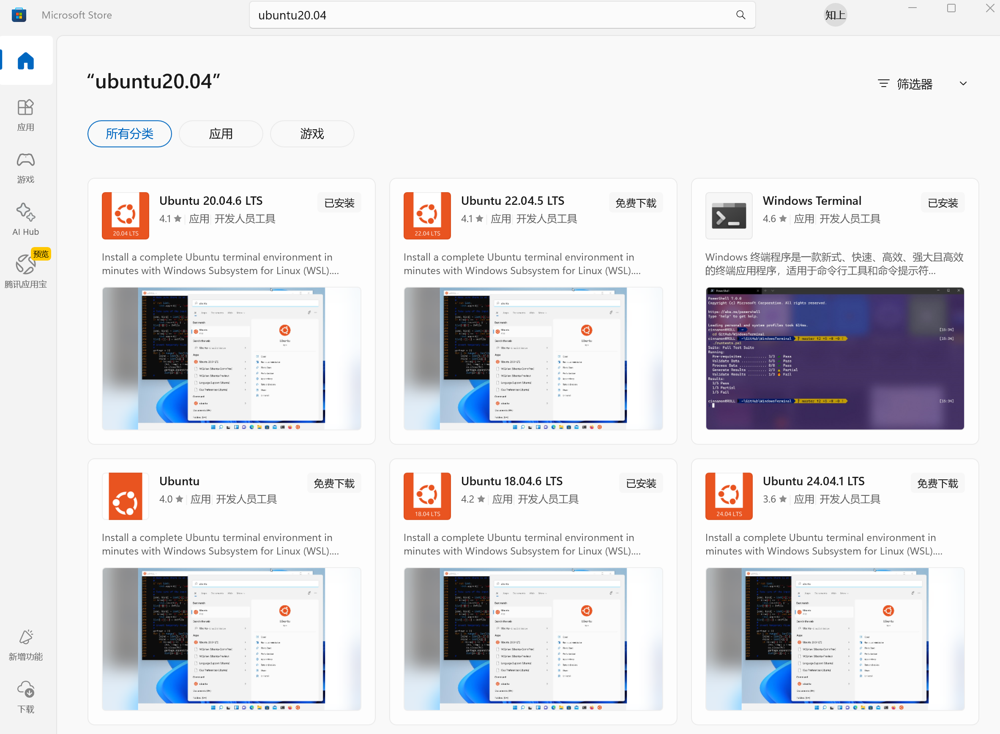

3. 找到官方的 Ubuntu 20.04 LTS，点进去。

4. 点击【安装】按钮，等待安装完成。

> 注意：安装过程中可能需要开启 WSL 功能，如未开启，系统会提示进行配置。

---

#### 1.1.2 初始化 Ubuntu 20.04

1. 打开终端（cmd 或 Windows Terminal），输入：

    ```bash
    wsl
    ```

2. 第一次启动 Ubuntu 会要求设置：
   - **用户名**（可自定义，记得使用小写字母）
   - **密码**（后续执行 sudo 指令时需要使用）

3. 完成设置后，即可进入 Ubuntu 系统终端。

---

#### 1.1.3 配置 WSL2（可选但推荐）

如果尚未启用 WSL2（在 Windows 环境下），请按照以下步骤进行升级和切换：

1. 确认当前 WSL 版本：

    ```bash
    wsl --list --verbose
    ```

将会展示您当前可用的 WSL 版本（标*号代表默认版本，如需指定进入某一 WSL 环境，可使用指令 `wsl -d ubuntu-xx.xx`）：

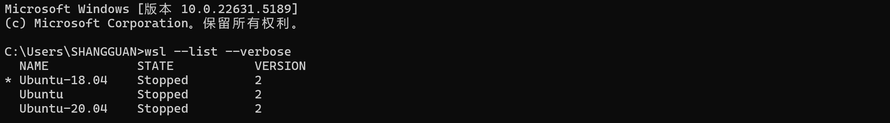

2. 设置默认版本为 WSL2：

    ```bash
    wsl --set-default-version 2
    ```

3. 检查 Ubuntu 是否运行在 WSL2：

    ```bash
    wsl -l -v
    ```

   显示 `Ubuntu-20.04 Running Version 2` 即配置成功。

---

#### 1.1.4 更新系统并安装常用工具

首次进入 Ubuntu 后，建议立即执行以下命令更新系统：

```bash
sudo apt update
sudo apt upgrade -y
```

> `apt update` 用于同步软件包索引，`apt upgrade` 更新已安装的软件到最新版本。

安装常用基础工具：

```bash
sudo apt install -y build-essential cmake git wget unzip
```

可以再操作一次，保险（不然容易有坑）:

```
sudo apt update
sudo apt install build-essential -y
```

> 包括 C++编译工具、CMake、Git 等基础开发环境。

---

### 1.2 安装 Conda 环境

#### 1.2.1 Conda 简介

**Conda** 是一款跨平台的开源包管理器和环境管理器，主要用于快速安装、管理不同版本的 Python 及其依赖库。

使用 Conda，可以轻松创建隔离的开发环境，避免不同项目之间因依赖冲突而产生问题。

本教程推荐安装 [**Miniconda**（最小安装版）](https://docs.conda.io/en/latest/miniconda.html)，原因如下：

- 体积小，仅包含 Conda 核心功能。
- 可根据需要自由安装其他包，避免 Anaconda 全家桶过度臃肿。
- 更适合定制轻量化深度学习开发环境。

---

#### 1.2.2 安装步骤

下载 Miniconda（推荐最小安装版）：

```bash
wget https://repo.anaconda.com/miniconda/Miniconda3-latest-Linux-x86_64.sh
```

给安装脚本执行权限：

```
chmod +x Miniconda3-latest-Linux-x86_64.sh
```

运行安装 Miniconda：

```bash
./Miniconda3-latest-Linux-x86_64.sh
```

- 按提示进行安装（一般一路回车，安装路径默认即可）
- 最后会问你是否初始化 conda 环境，选择【yes】并回车

安装完成后，激活 Conda：

```bash
source ~/.bashrc
```

创建新的 Python 环境（推荐 Python 3.9）：

```bash
conda create -n yolov11n python=3.9 -y
conda activate yolov11n
```

> 将所有后续操作都放在 `yolov11n` 这个独立环境中，避免污染系统环境。

---

### 1.3 安装 PyTorch

#### 1.3.1 PyTorch 简介

[**PyTorch**](https://pytorch.org/get-started/locally/) 是由 Facebook AI Research（FAIR）团队开发的开源深度学习框架，  
以其动态计算图、高灵活性和强大性能广受研究与工业界青睐。

在本项目中，PyTorch 作为核心框架，负责模型的搭建、训练与推理。

选择 PyTorch 版本时，需要注意：

- **Python版本**：确保与 Conda 环境一致（本教程用 Python 3.9）
- **CUDA版本**：确保与本机 CUDA 驱动版本兼容（本教程用 CUDA 11.8）

---

#### 1.3.2 安装步骤

首先激活`yolov11n`环境（如果没有）：

```bash
conda activate yolov11n
```

激活后你会看到前面的提示符变成：

```plaintext
(yolov11n) yourname@yourdevicename:~$
```

表示你现在就在新的yolov11n环境里了。

> 以下示例以 CUDA 11.8 版本为例：

在`(yolov11n)`环境下直接执行：

```bash
pip install torch torchvision torchaudio --index-url https://download.pytorch.org/whl/cu118
```

> 从官方渠道安装兼容 CUDA 11.8 的 PyTorch。

---

### 1.4 安装 CUDA

#### 1.4.1 CUDA 简介

[**CUDA（Compute Unified Device Architecture）**](https://developer.nvidia.com/cuda-toolkit) 是 NVIDIA 提供的并行计算平台和编程模型，  
它允许开发者直接使用 GPU 进行高效的通用计算。

在深度学习领域，CUDA 是加速神经网络训练和推理不可或缺的基础组件。

本教程以 **CUDA 11.8** 版本为例，配合 PyTorch 和 TensorRT 进行部署。

---

#### 1.4.2 是否需要安装 CUDA？

- 如果您的机器（本操作系统环境 Ubuntu20.04 下）已经正确安装了合适版本的 CUDA 驱动，可**跳过**此步骤。
- 否则，请按照以下流程安装新的 NVIDIA 驱动和 CUDA Toolkit。

---

#### 1.4.3 安装 NVIDIA 驱动（可选）

检查现有驱动：

```bash
nvidia-smi
```

若无驱动，请参考 [NVIDIA 官方指南](https://www.nvidia.com/Download/index.aspx?lang=en-us)安装对应版本。

---

#### 1.4.4 安装 CUDA Toolkit

添加官方仓库

```bash
sudo apt update
sudo apt install -y wget gnupg
sudo wget https://developer.download.nvidia.com/compute/cuda/repos/ubuntu2004/x86_64/cuda-ubuntu2004.pin
sudo mv cuda-ubuntu2004.pin /etc/apt/preferences.d/cuda-repository-pin-600
```

安装`deb`包到系统

```bash
sudo dpkg -i cuda-repo-ubuntu2004-11-8-local_11.8.0-520.61.05-1_amd64.deb
```

复制 Key 文件（注册仓库）

```bash
sudo cp /var/cuda-repo-ubuntu2004-11-8-local/cuda-*-keyring.gpg /usr/share/keyrings/
```

更新`apt`索引

```bash
sudo apt update
```

安装 CUDA Toolkit

```bash
sudo apt install -y cuda-toolkit-11-8
```

把 CUDA 路径加到 PATH 环境变量里

```bash
echo 'export PATH=/usr/local/cuda-11.8/bin${PATH:+:${PATH}}' >> ~/.bashrc
echo 'export LD_LIBRARY_PATH=/usr/local/cuda-11.8/lib64${LD_LIBRARY_PATH:+:${LD_LIBRARY_PATH}}' >> ~/.bashrc
source ~/.bashrc
```

验证 CUDA 安装

```bash
nvcc --version
```

> 将出现你的 CUDA 版本号

---

#### 1.4.5 安装推理需要的辅助工具包

在`(yolov11n)`环境下（如不在，请激活）：

```bash
conda activate yolov11n
```

然后安装：

```bash
pip install pycuda
pip install opencv-python numpy
```

---

### 1.5 安装 cuDNN

#### 1.5.1 cuDNN 简介

**cuDNN（CUDA Deep Neural Network library）** 是由 NVIDIA 提供的深度学习加速库，  
它针对常见的神经网络运算（如卷积、池化、归一化等）进行了底层优化，能够极大提升 GPU 运算性能。

在深度学习训练和推理过程中，cuDNN 是 PyTorch、TensorFlow 等框架依赖的重要组件。

---

#### 1.5.2 版本选择说明

- cuDNN 必须与安装的 CUDA 版本对应。
- 本教程基于 **CUDA 11.8**，因此需下载 **cuDNN 8.x for CUDA 11.x** 系列版本。
- 建议下载与 TensorRT 兼容的 cuDNN 版本，确保后续推理加速顺利。

---

#### 1.5.3 下载 cuDNN

1. 访问 [NVIDIA cuDNN官网](https://developer.nvidia.cn/rdp/cudnn-archive)。
2. 登录 NVIDIA Developer 账号（如没有请先注册）。
3. 在下载页面选择：
   - 操作系统：Linux
   - CUDA 版本：CUDA 11.x
   - 安装包格式：`.tar.xz` 压缩包

> 找到如下所示界面即可，选择Linux x86_64 的本地安装程序 (Tar)

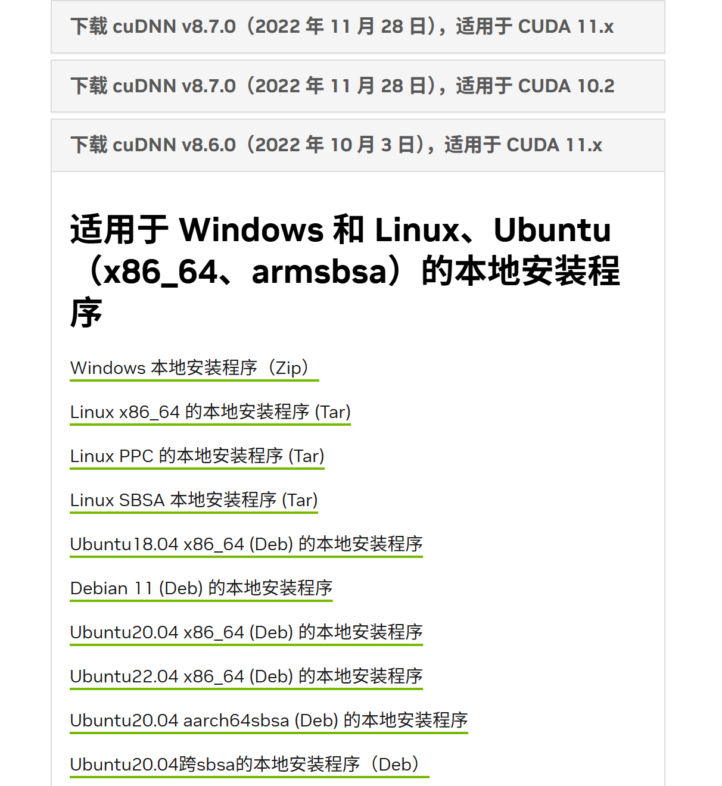

下载完成后，获得类似以下文件：

```plaintext
cudnn-linux-x86_64-8.6.0.163_cuda11-archive.tar.xz
```

复制 cuDNN 安装包（从你刚刚下载到的路径）到 Ubuntu 家目录 

```bash
cp /mnt/c/Users/xxxxxxxx/Downloads/cudnn-linux-x86_64-8.6.0.163_cuda11-archive.tar.xz ~/
```

解压 cuDNN 包

```bash
cd ~
tar -xvf cudnn-linux-x86_64-8.6.0.163_cuda11-archive.tar.xz
```

解压后应该出现一个目录：

```bash
cudnn-linux-x86_64-8.6.0.163_cuda11-archive/
```

把 cuDNN 文件拷贝到 CUDA 11.8 路径

```bash
cd cudnn-linux-x86_64-8.6.0.163_cuda11-archive
sudo cp include/* /usr/local/cuda-11.8/include/
sudo cp lib/* /usr/local/cuda-11.8/lib64/
```

---

### 1.6 安装 TensorRT

#### 1.6.1 TensorRT 简介

[**TensorRT**](https://developer.nvidia.com/tensorrt) 是 NVIDIA 开发的高性能推理加速库，  
它能够将训练好的深度学习模型进行优化（如层融合、精度降低），显著提升模型在 NVIDIA GPU 上的推理速度与效率。

TensorRT 特别适用于模型部署阶段，可以最大化利用 GPU 的计算资源，  
本教程中将用于加速 YOLOv11n 的推理过程。

---

#### 1.6.2 版本选择说明

- TensorRT 必须与本地的 **CUDA** 和 **cuDNN** 版本兼容。
- 本教程使用 **TensorRT 8.6.1**，适配 **CUDA 11.8**。
- 请根据自己系统和 CUDA 版本选择合适的 TensorRT 版本。

---

#### 1.6.3 安装步骤

下载 TensorRT（以 TensorRT 8.6.1 为例）：

```bash
cd ~
wget https://developer.nvidia.com/downloads/compute/machine-learning/tensorrt/secure/8.6.1/tars/TensorRT-8.6.1.6.Linux.x86_64-gnu.cuda-11.8.tar.gz
```

解压 TensorRT：

```bash
cd ~
tar -xzvf TensorRT-8.6.1.6.Linux.x86_64-gnu.cuda-11.8.tar.gz
```

解压成功后应该出现很多很多`extracting`的日志，比如：

```bash
TensorRT-8.6.1.6/README.md
TensorRT-8.6.1.6/bin/trtexec
TensorRT-8.6.1.6/python/tensorrt/__init__.py
...
```

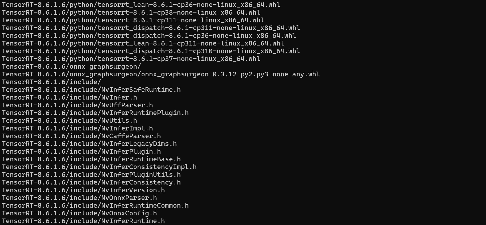

解压完成后，切换到 TensorRT 的 python 目录：

```bash
cd ~/TensorRT-8.6.1.6/python
```

执行安装命令：

```bash
pip install tensorrt-8.6.1-cp39-none-linux_x86_64.whl
```

测试 TensorRT 安装：

```bash
python -c "import tensorrt as trt; print(trt.__version__)"
```

> 输出 TensorRT 版本号即表示安装成功。

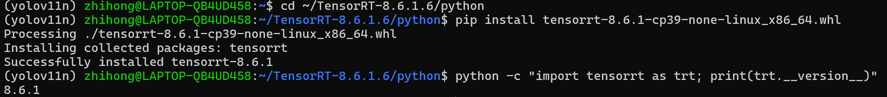

---

### 1.7 环境配置总结及建议

本章依次讲解了**Ubuntu 20.04 操作系统**、**Conda 虚拟环境**、**PyTorch**、**CUDA 11.8**、**cuDNN** 以及 **TensorRT 8.6.1** 的基础环境配置流程。

您可以通过以下指令来验证您的环境是否符合要求：

```bash
cd ~
conda activate yolov11n
python --version
nvcc --version
python -c "import pycuda.driver as cuda; cuda.init(); print(cuda.Device.count())"
python -c "import tensorrt; print(tensorrt.__version__)"
python -c "import numpy; print(numpy.__version__)"
python -c "import cv2; print(cv2.__version__)"
```

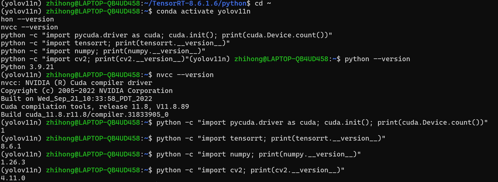

> 需要提醒的是，由于上述内容部分参考了个人实践经验、ChatGPT 协助以及官方文档示例，实际操作过程中可能因系统环境差异、版本更新等原因出现小幅偏差。即便严格按照本教程执行，首次搭建时也可能遇到问题。

> 希望您在阅读和实践过程中保持耐心，遇到问题时积极查找资料、多加尝试，相信最终一定能够顺利完成环境配置。

接下来，我们将正式进入 **YOLOv11n 模型训练** 部分的讲解。

---

## 2. YOLOv11n 模型训练

### 2.1 开发环境与数据集准备

在本项目中，我们使用 **Visual Studio Code（VS Code）** 作为主要开发环境。  
VS Code 提供了丰富的插件生态，能够大大提高本项目的开发效率，例如：
- Python 插件（代码高亮、智能补全、虚拟环境管理）
- Remote WSL 插件（便于在 WSL2 下直接开发）
- Git 插件（版本控制）

强烈建议根据个人需求合理配置插件环境，以提升开发体验。

> 安装 WSL 插件之后，您将会在左下角看见蓝色图标，之后在上方选择 `Connect to WSL Using...` 之后即可选择您需要的版本（Ubuntu-20.04）:

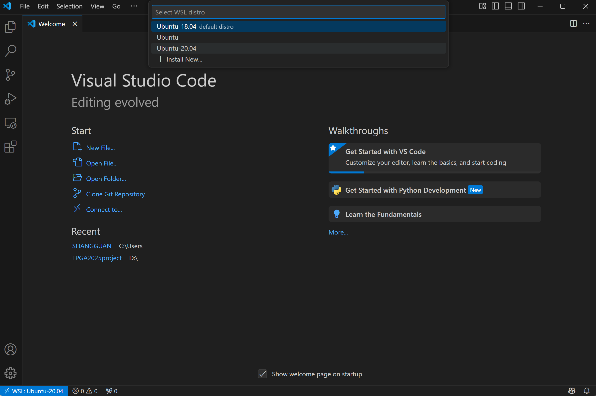

---

### 2.2 训练集介绍

本项目使用的数据集为 [**SODA10M**](https://soda-2d.github.io/)。  
以下是官方对该数据集的简介：

> **SODA10M**（SODA: Semi-supervised Object Detection for Autonomous driving）  
> 是由 **华为诺亚方舟实验室**、**中山大学** 和 **香港科技大学** 联合发布的一个大规模自动驾驶感知数据集。  
> 该数据集于 **2021年7月** 正式公开，旨在推动自动驾驶领域的自监督学习、领域自适应与大规模预训练技术的发展。

数据集特点如下：

- 包含 1000 万张未标注图片和 2 万张带标注的图片。
- 覆盖 6 类典型自动驾驶场景下的重要目标物体。
- 目前为止最大的 2D 自动驾驶图像数据集之一。
- 设计目标是支持未来工业级自动驾驶系统中自我探索、自我学习和自适应能力的训练。

SODA10M 也是 **ICCV 2021 SSLAD Challenge** 的官方基准数据集。

若需进一步了解或咨询相关问题，可联系官方邮箱：
- xu.hang@huawei.com
- hanjianhua4@huawei.com

---

### 2.3 数据下载与结构说明

在下载数据时，我们获得了如下两个压缩包：

- `labeled_trainval.tar`（包含训练集与验证集）
- `labeled_test.tar`（包含测试集）

解压后目录结构如下（以`labeled_trainval.tar`为例）：

```plaintext
SSLAD-2D/
└── labeled/
    ├── annotations/    # 标注文件（JSON格式）
    ├── train/          # 训练集图片
    └── val/            # 验证集图片
```

---

### 2.4 标注格式说明

在数据解压完成后，我们可以看到 annotations/ 文件夹中保存了所有图片的标注信息，对应一个 JSON 格式的标注文件。

虽然标注信息完整，但这些 JSON 文件**不能直接用于 YOLOv11n 训练**。  
这是因为当前标注文件与 YOLO要求的格式在**结构、表达方式和单位定义**上存在明显差异。

---

#### 2.4.1 当前 JSON 格式存在的问题

通过查看原始 JSON 文件可以发现：

- 每个 JSON 文件中，边界框（bbox）位置采用的是 **左上角坐标 (x, y)** 加上 **宽 (w)** 和 **高 (h)**，且单位为 **像素**。
- 坐标信息是基于图片原始分辨率的，没有进行归一化。
- 每个对象标注中包含了丰富但与训练无关的额外字段，例如时间戳、图像尺寸、标注工具信息等。
- 类别标签采用的可能是文本描述或者自定义编码，不一定符合 YOLO所需的连续数字编码（0,1,2,...）。

> ⚠️ 如果直接使用这套 JSON 文件进行 YOLO训练，将导致训练过程报错或模型性能异常。

因此，必须对标注文件进行**结构转换**和**格式规范化**处理。

---

#### 2.4.2 什么是 YOLO 格式？

YOLO系列（包括YOLOv5/YOLOv7/YOLOv11n等）在训练时要求：

- 每张图片必须对应一个 `.txt` 文件，文件名与图片同名（只扩展名不同）。
- `.txt` 文件每一行代表一个目标物体，格式为：

    ```plaintext
    <class_id> <x_center> <y_center> <width> <height>
    ```

具体要求如下：

| 字段 | 描述 | 说明 |
| :--- | :--- | :--- |
| class_id | 类别编号 | 必须是整数，从0开始 |
| x_center | 中心点X坐标 | 相对于图片宽度归一化到0~1 |
| y_center | 中心点Y坐标 | 相对于图片高度归一化到0~1 |
| width | 边界框宽度 | 相对于图片宽度归一化 |
| height | 边界框高度 | 相对于图片高度归一化 |

**归一化计算公式**：

- `x_center = (bbox_x + bbox_w/2) / image_width`
- `y_center = (bbox_y + bbox_h/2) / image_height`
- `width = bbox_w / image_width`
- `height = bbox_h / image_height`

这里：

- `(bbox_x, bbox_y)` 是边界框左上角像素坐标
- `bbox_w, bbox_h` 是边界框的宽和高

---

#### 2.4.3 为什么YOLO采用这种格式？

YOLO采用这种归一化且结构简洁的标注格式，有以下原因：

- **跨分辨率兼容性好**：无论图片是640×640还是1280×720，只要归一化后都是统一标准。
- **数据读取快**：每行一组浮点数，直接送入训练管道，无需复杂解析。
- **训练更高效**：简化了I/O流程，加快了数据预处理速度。

因此，如果要在 YOLOv11n 上正确训练模型，必须保证输入的图片和标注文件都符合这一格式规范。

---

#### 2.4.4 格式转换的必要性

总结来说：

| 项目 | JSON 原始标注 | YOLO 训练要求 |
| :--- | :--- | :--- |
| 文件类型 | `.json` | `.txt` |
| 坐标描述 | 左上角(x,y) + 宽高(w,h)，像素值 | 中心点(x,y) + 宽高(w,h)，相对比例 |
| 类别标签 | 可能是文本或自定义数字 | 必须是连续整数（0,1,2,...） |
| 额外信息 | 含有冗余字段 | 仅保留必要字段 |

因此，在正式训练之前，必须先批量处理整个 `annotations/` 文件夹，  
将每张图片的 JSON 标注转换为符合 YOLO格式的 `.txt` 文件，并放置在对应的目录下。

---

#### 2.4.5 标注文件转换

为了方便快速地将 SODA10M 的原始 JSON 标注文件批量转换为 YOLO格式，  
我们在项目目录下 `scripts/` 文件夹中准备了一个转换脚本：

> `coco2yolo.py`

该脚本功能如下：

- 读取统一的大JSON标注文件（符合COCO风格结构）
- 按照 YOLOv11n 要求，将每个目标的标注转换为归一化格式
- 自动为每张图片生成对应的 `.txt` 标签文件
- 按图片分类组织输出到指定的 `labels/` 目录
- 支持输出类别映射（方便后续生成 `data.yaml`）

---

#### 2.4.6 数据重新划分与重命名

原始数据集在标注阶段划分不合理，导致训练集与验证集比例失衡。  
为了更科学合理地训练YOLOv11n模型，本项目重新划分数据集，按照 **8:2** 的比例分配训练集与验证集。

同时，在划分过程中，为避免图片文件名重复或编号混乱，我们对图片及其对应标签进行了统一重命名处理。

在 `scripts/` 文件夹下，准备了对应的脚本：

> `dataset_redistribute.py`

---

该脚本功能如下：

- 遍历指定目录下的图片和标签文件
- 按设定的比例（例如 8:2）随机划分为训练集和验证集
- 自动将图片及对应的 `.txt` 标签文件拷贝到新的 `train/` 与 `val/` 文件夹
- 统一按照新的编号规则进行命名，如：
  - `0001.jpg`
  - `0001.txt`
- 保证每张图片与其对应的标签一一对应，且编号连续。

---

### 2.5 生成 data.yaml 文件

在YOLOv11n的训练过程中，需要提供一个名为 `data.yaml` 的配置文件，  
用于指定训练集、验证集、类别数量及类别名称等信息。

该文件是启动训练任务时的重要输入，必须根据实际数据集结构进行正确配置。这个文件应存放于dataset目录下，和images文件夹以及labels文件夹并列放置。

---

#### data.yaml 文件内容示例

以本项目的设置为例，典型的 `data.yaml` 内容如下：

```yaml
path: your_dataset_directory/
train: images/train
val: images/val
nc: 6
names: ['Car', 'Cyclist', 'Pedestrian', 'Tram', 'Tricycle', 'Truck']
```

---

### 2.6 数据集整理总结与说明

为了方便大家快速上手，本项目已经在 `yolov11n/` 目录下，  
提前准备好了一份可以直接用于训练的完整数据集：

> `dataset/`

---

#### dataset 文件夹结构

```plaintext
dataset/
├── images/
│   ├── train/    # 训练集图片
│   └── val/      # 验证集图片
├── labels/
│   ├── train/    # 训练集标签（YOLO格式）
│   └── val/      # 验证集标签（YOLO格式）
└── data.yaml     # 训练配置文件
```

---

### 2.7 训练 YOLOv11n

数据准备工作完成后，即可正式开始 YOLOv11n 模型的训练。

在执行训练前，请确保以下依赖环境已经正确安装：

- Python
- PyTorch（推荐CUDA版本，如 11.8）
- Ultralytics YOLO 库

安装Ultralytics YOLO库：

```bash
pip install ultralytics
```

#### 2.7.1 模型配置文件 yolo11.yaml 说明

在本项目中，YOLOv11n 模型结构配置文件位于：

> `models/yolo11.yaml`

该文件定义了：

- 模型的类别数量（nc）
- 模型的深度、宽度复合缩放参数（scales）
- Backbone（特征提取骨干网络）结构
- Head（检测头）结构

---

```yaml
# Number of classes
nc: 6
```

> 本项目基于道路障碍物检测数据集，包含 6 个类别，因此设定为 ``nc: 6``

---

#### 2.7.2 正式训练

为了简化训练流程，本项目已经准备了一个训练脚本：

> `train.py`

---

`train.py` 脚本集成了模型训练所需的基本流程，主要功能包括：

- 加载 `dataset/data.yaml` 配置文件
- 选择指定的 YOLOv11n 模型结构（如 yolo11.yaml）
- 加载预训练模型权重 `yolo11n.pt`
- 设置训练超参数（如 epochs、batch size、img size）
- 自动保存训练日志与模型权重
- 支持断点续训与模型验证

通过执行 `train.py`，可以一键完成模型训练启动，避免手动繁琐配置。可根据自身需求，修改如下参数。

| 参数     | 作用                           | 预设值                   | 备注                                     |
|:---------|:-------------------------------|:-------------------------|:----------------------------------------|
| model    | 指定模型结构或预训练权重         | "your_model(.pt/.yaml)"    | 需替换为实际模型文件，如 `yolov11.yaml` |
| data     | 指定数据集配置文件路径           | "your_data.yaml"          | 需替换为实际 `dataset/data.yaml`         |
| epochs   | 训练轮数                         | 80                       | 可根据任务复杂度调整，常用范围30~300      |
| imgsz    | 输入图像尺寸                     | 640                      | 尺寸越大精度可能更好，训练速度越慢        |
| batch    | 每批次处理图片数量               | 16                       | 根据GPU显存大小适当调整                  |
| name     | 当前训练任务名称                 | "road_obstacle_yolov11"   | 输出目录下的子文件夹名称                  |
| project  | 输出目录                         | "output_directory"       | 所有结果保存的根目录                     |
| resume   | 是否断点续训                     | False                    | 若中途中断，可设为 `True` 继续            |
| device   | 指定使用的设备                   | 0                        | GPU编号，-1代表使用CPU训练                |

> 若中途中断，可将 `resume` 设为 `True` 继续，并且将 `model` 改成输出目录下 `weights/last.pt`，还要将加载预训练权重参数这个步骤注释掉。此操作将会在下次运行时从中断的位置继续训练。

---

#### 2.7.3 训练结果分析

训练完成后，会输出各项指标：

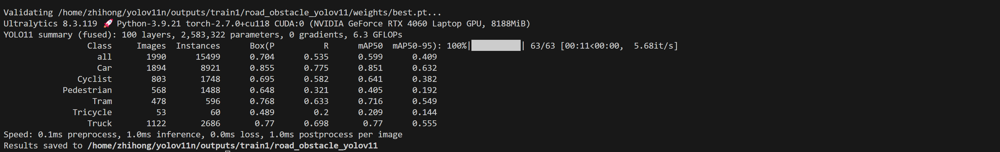

同时在输出目录下（如 `output_directory/road_obstacle_yolov11/`）  
将自动生成如下文件和子文件夹：

---

weights/

- `best.pt`：训练过程中性能最优的模型权重（通常用这个做推理）
- `last.pt`：训练最后一轮保存的模型权重

常用建议：
- 推理或部署时，优先使用 `best.pt`
- 若训练中断，可使用 `last.pt` 继续训练（配合 `resume=True`）

---

args.yaml

- 记录了本次训练使用的所有参数设置（如 batch size, epochs, img size 等）。
- 便于后续复现实验或查错。

---

results.png

- 显示训练期间各项指标变化趋势，如：
  - **训练损失（train/val loss）**
  - **精确率（Precision）**
  - **召回率（Recall）**
  - **mAP（mean Average Precision）**

通过观察曲线，可以直观了解模型训练是否收敛，是否存在过拟合等问题。

---

confusion_matrix.png & confusion_matrix_normalized.png

- 生成的混淆矩阵图，展示不同类别间的预测准确性。
- 用来分析模型在各类目标上的区分能力。

---

PR_curve.png / P_curve.png / R_curve.png / F1_curve.png

- 绘制各类别在不同置信度阈值下的 Precision-Recall 曲线、F1分数曲线等。
- 用于更细致地评估检测性能。

---

results.csv

- 以表格形式记录每一轮训练和验证的详细指标数据。
- 可用于后续自定义绘图、统计分析。

---

## 3. YOLOv11n 模型加速与部署

完成模型训练后，虽然我们可以直接使用 `.pt` 权重文件进行推理，但在实际部署场景中，往往对 **推理速度、部署平台兼容性** 有更高要求。此时，我们通常会采用 NVIDIA 提供的高性能推理加速框架 —— **TensorRT**，将模型转换为 `.engine` 文件，以获得更优的推理速度与更低的延迟。

本章将完整介绍 YOLOv11n 模型从训练产物 `.pt` 文件出发，  
如何依次完成以下三个阶段的转换与优化：

> 1. **从 `.pt` 转换为 `.onnx`** —— 通用模型交换格式  
> 2. **从 `.onnx` 编译为 `.engine`** —— TensorRT 推理引擎格式  
> 3. **部署推理与加速验证** —— 测试运行效果与速度提升

---

### 为什么要这么做？

| 模型格式 | 用途 | 优势 | 劣势 |
|:--------|:-----|:------|:------|
| `.pt`   | 训练/开发 | 灵活、支持PyTorch全功能 | 推理速度慢、依赖PyTorch环境 |
| `.onnx` | 通用中间格式 | 跨平台、易部署 | 推理性能不如TensorRT |
| `.engine` | 部署加速 | NVIDIA GPU上极致性能 | 不跨平台、编译耗时 |

---

在本章结束后，你将掌握：

- 如何将 YOLOv11n 模型导出为 `.onnx`
- 如何使用 TensorRT 编译 `.engine` 文件
- 如何进行 TensorRT 加速推理测试与性能对比分析

接下来，我们从模型导出流程总览开始讲起。

---

### 3.1 模型导出流程总览

在正式进行部署加速前，我们首先要了解整个模型导出与转换的完整流程。

本章采用的流程分为三大步骤：

---

#### Step 1：从 PyTorch `.pt` 导出为 ONNX `.onnx`

- `.pt` 是 PyTorch 框架专有的模型保存格式，包含了模型结构和参数。
- 为了跨平台部署（如 TensorRT、OpenVINO、ONNXRuntime），需要先将 `.pt` 转换为标准的 **ONNX格式**。
- ONNX（Open Neural Network Exchange）是一种开放的模型交换格式，支持在不同深度学习框架间转移模型。

导出完成后得到 `.onnx` 文件，作为中间交换格式。

---

#### Step 2：从 ONNX `.onnx` 编译为 TensorRT `.engine`

- ONNX 文件可以直接通过 TensorRT 工具链进行解析和优化，生成高效的推理引擎 `.engine` 文件。
- `.engine` 是 TensorRT 内部高度优化后的模型格式，针对特定硬件（GPU架构、CUDA版本）进行深度定制。
- 编译过程中，可以选择 FP32 / FP16 / INT8 等精度模式，进一步加速推理速度。

导出完成后得到 `.engine` 文件，适用于生产部署环境。

---

#### Step 3：使用 TensorRT `.engine` 文件进行推理测试

- 将编译好的 `.engine` 加载到 TensorRT 推理引擎中，进行图像或视频的检测任务。
- 相比于原生 PyTorch 推理，TensorRT 加速后推理速度可提升 2~5倍以上（取决于硬件和模型规模）。

此时可以评估：

- 加速前后的 FPS（帧率）变化
- 推理延迟（latency）
- 精度变化情况

---

#### 总体流程图示

```plaintext
best.pt 文件
      ↓
(导出 ONNX)
      ↓
best.onnx 文件
      ↓
(编译 TensorRT 引擎)
      ↓
best.engine 文件
      ↓
(推理加速测试)
```

---

### 3.2 导出 ONNX 模型

---

#### 3.2.1 必要环境依赖

[**Netron**](https://netron.app/) 是一款开源的神经网络模型可视化工具，  
支持多种模型格式（如 `.onnx`、`.pb`、`.h5`、`.tflite`、`.mlmodel` 等）。

在本项目中，Netron主要用于：

- 打开导出的 `.onnx` 文件
- 可视化查看 YOLOv11n 模型的结构（包括输入输出、每一层的连接）
- 帮助理解模型的 Backbone、Neck、Head等组件布局
- 验证导出后的模型是否正确完整

---

确保环境中安装了以下Python库：

```bash
pip install ultralytics onnx netron 
```

如果导出时报错提示缺少模块，可以单独补充安装：

```bash
pip install onnx 
```

---

#### 3.2.2 导出 onnx 模型

为了方便将训练好的 best.pt 文件转换为通用的 .onnx 格式，
本项目准备了一个简洁实用的导出脚本：

> pt2onnx.py

> 注意事项：由于使用 Ultralytics 官方模型，其默认导出的 ONNX 模型输入尺寸为 640×640，会与训练阶段保持一致。如果需要导出其他尺寸的输入，可以使用如下方法指定：

```python
model.export(format='onnx', imgsz=(384, 640)) 
```

导出的时候可能会出现如下错误：

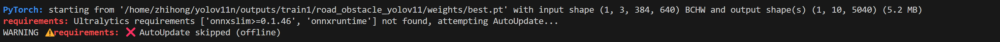

解决办法：安装以下工具集：

```bash
pip install onnx onnxruntime onnxsim netron
```

导出成功会出现如下信息，警告可忽略，因为我们只是为了导出推理模型，将不会使用val验证：

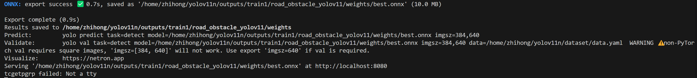


---

### 3.3 导出 TensorRT Engine

为了实现更高效的推理部署，本节将讲解如何将 `.onnx` 模型转换为 `.engine` 引擎格式。

---

#### 3.3.1 为什么要导出TensorRT Engine

TensorRT是NVIDIA推出的高性能推理优化库，  
能够针对GPU硬件深度优化神经网络模型。  

使用TensorRT Engine模型的好处：

- 显著提升推理速度（吞吐量更高）
- 显著降低推理延迟
- 减少显存占用
- 支持FP16混合精度推理
- 更适合实际部署到服务器或边缘设备

因此，训练完成后的YOLOv11n模型，推荐导出为TensorRT Engine格式以加速推理。

---

#### 3.3.2 使用 trtexec 工具导出 Engine

确保环境中已正确安装：

- TensorRT（本教程示例基于TensorRT 8.x）
- CUDA Toolkit（与TensorRT版本匹配）
- 已导出的 `.onnx` 模型文件（如 `best.onnx`）

打开终端，执行如下命令：

```bash
conda activate yolov11n
cd ~
~/TensorRT-8.6.1.6/bin/trtexec --onnx=/home/zhihong/yolov11n/outputs/train1/road_obstacle_yolov11/weights/best.onnx --saveEngine=/home/zhihong/yolov11n/outputs/train1/road_obstacle_yolov11/weights/best.engine --explicitBatch --workspace=4096 --fp16
```

执行成功后，将生成 `.engine` 文件，供后续高效推理使用。

---

### 3.4 小结：YOLOv11n 模型部署导出流程

本节总结了从 `.pt` 到 `.engine` 的全过程，构建了完整的 YOLOv11n 模型部署优化链路：

---

#### 导出流程回顾

| 步骤 | 输入 | 输出 | 工具 | 说明 |
|------|------|------|------|------|
| Step 1 | `best.pt` | `best.onnx` | Ultralytics | 使用 `model.export(format='onnx')` 导出 |
| Step 2 | `best.onnx` | `best.engine` | TensorRT (`trtexec`) | 使用 TensorRT 编译为高效推理格式 |

---

#### 模型格式对比

| 格式 | 优势 | 劣势 | 适用阶段 |
|------|------|------|------------|
| `.pt` | 灵活，支持训练与微调 | 推理速度慢，依赖 PyTorch 环境 | 模型训练与开发 |
| `.onnx` | 跨平台通用，支持多后端部署 | 推理速度中等，不支持所有优化 | 中间格式转换 |
| `.engine` | 极致推理速度，支持混合精度 | 编译耗时，不跨平台 | 部署与推理加速 |

---

#### 常见问题回顾

- `onnxsim` 报错：缺少依赖 → `pip install onnxsim`
- 图像尺寸警告：默认导出尺寸为 `640x640`，非正方形需指定 `imgsz=(h, w)`
- trtexec 执行失败：注意空格错误，如 `--saveEngine= 路径` 中不能有空格

---

#### 产物路径整理

```plaintext
项目目录/
├── outputs/
│   └── train1/
│       └── road_obstacle_yolov11/
│           └── weights/
│               ├── best.pt       # 训练权重
│               ├── best.onnx     # 中间格式
│               └── best.engine   # 推理引擎
```

---

#### 小结与展望

本章完成了 YOLOv11n 模型的加速与部署准备工作，产出了可直接部署的 `.engine` 文件。
下一章将进入推理阶段，测试模型在真实图像上的推理效果与性能表现，  
并尝试构建完整的推理 pipeline（读取图片 → 推理 → 可视化）。

---

## 4. YOLOv11n 的 TensorRT 加速推理实践

在完成 `.engine` 文件的导出后，模型已经具备高效推理的条件。为了实现真正的部署落地，我们需要进一步掌握 GPU 推理的实际调用方法，尤其是在视频流实时检测任务中，如何充分发挥 CUDA 的并行计算优势。

本章将围绕以下几个核心问题展开讲解：

- 如何使用 PyCUDA 实现 GPU 级图像预处理？
- CUDA 核函数如何嵌入 Python 中并进行调用？
- 如何用 TensorRT 引擎进行高性能异步推理？
- 实时视频流的解码、推理与可视化如何整合？

---

### 4.1 PyCUDA 与 CUDA 加速预处理简介

在部署流程中，图像预处理（如缩放、填充、归一化）是计算瓶颈之一。传统方式使用 `cv2` 处理图像后再送入 GPU，效率较低。本项目采用 **PyCUDA + 自定义 CUDA 核函数** 的组合，实现了预处理阶段的显著加速。

关键实现代码如下：

```python
from pycuda.compiler import SourceModule

resize_norm_pad_kernel_code = """ ... """  # CUDA 核函数源码
mod = SourceModule(resize_norm_pad_kernel_code)
resize_pad_norm_kernel = mod.get_function("resize_pad_norm")
```

自定义核函数 `resize_pad_norm` 用于：

- 将原图按比例缩放至目标尺寸（如 640×384）
- 填充边缘并归一化至 `[0,1]`
- 三通道并行处理，提升吞吐效率

使用方式：

```python
resize_pad_norm_kernel(..., block=(16,16,1), grid=(W,H,3))
```

该预处理步骤在 GPU 上完成，避免了 CPU↔GPU 频繁拷贝，大幅节省时间。

---

### 4.2 TensorRT 推理引擎调用

通过 TensorRT 的 `deserialize_cuda_engine()` 与 `create_execution_context()`，我们可以直接加载 `.engine` 文件并进行异步推理：

```python
with open(engine_path, 'rb') as f:
    engine = runtime.deserialize_cuda_engine(f.read())
context = engine.create_execution_context()
```

执行推理的流程为：

1. `cuda.mem_alloc()` 为输入/输出申请显存
2. `cuda_preprocess()` 将图片写入显存
3. `context.execute_async_v2()` 异步调用推理
4. `cuda.memcpy_dtoh_async()` 拷回推理结果

全部通过 **CUDA Stream** 并行处理，最大化利用 GPU：

```python
stream = cuda.Stream()
context.execute_async_v2(bindings=bindings, stream_handle=stream.handle)
```

---

### 4.3 后处理与可视化流程

推理输出为 `[N, 10, 5040]`，代表多目标检测的分类分数与预测框位置。后处理包含：

- sigmoid 解码
- score 阈值筛选
- NMS 非极大值抑制
- 边界框坐标映射回原图

YOLO 模型的输出需要通过后处理流程转化为最终的检测框结果。该流程包括以下步骤：

---

#### 4.3.1 Sigmoid 解码

模型原始输出的 `cls_logits` 为未归一化的分类得分，通过 sigmoid 将其映射到 `[0, 1]` 区间，代表每一类的置信度。

```python
cls_scores = sigmoid(cls_logits)
```

---

#### 4.3.2 Score 置信度阈值筛选

选取最大置信度对应的类别，并对置信度进行阈值过滤，去除低可信框：

```python
conf = cls_scores.max(axis=1)
keep = conf > conf_thres
```

---

#### 4.3.3 NMS（非极大值抑制）

对重叠框进行筛选，只保留最大置信度框，其余高度重叠的框将被抑制：

```python
ious = compute_iou(reference_box, candidate_boxes)
filtered_boxes = candidate_boxes[ious < iou_thres]
```

---

#### 4.3.4 坐标映射回原图

模型输入经过缩放与填充处理，输出框坐标需映射回原图尺度，确保视觉结果准确：

```python
xyxy[:, [0,2]] = (xyxy[:, [0,2]] - pad_x) / scale
```

---

最终使用 OpenCV 将目标框绘制并展示：

```python
cv2.rectangle(frame, ...)
cv2.putText(frame, ...)
```

---

### 4.4 实时推理脚本使用说明

我们提供了完整的 Python 脚本 `realtime_infer.py` 以及 `scripts/video_infer.py` 实现从视频文件读取 → GPU 预处理 → TensorRT 推理 → OpenCV 可视化 的全流程，适用于多类别目标检测任务。

核心参数说明：

| 参数 | 示例值 | 说明 |
|------|--------|------|
| `engine_path` | best.engine | TensorRT 引擎文件路径 |
| `video_source` | 0 或 video.mp4 | 摄像头编号或视频路径 |
| `save_path` | xxx.mp4 | 结果视频保存路径（可选） |
| `target_fps` | 30 | 控制帧率，避免 GPU 过载 |

运行成功后，将在窗口中实时展示推理结果，并在指定路径保存带检测框的视频：

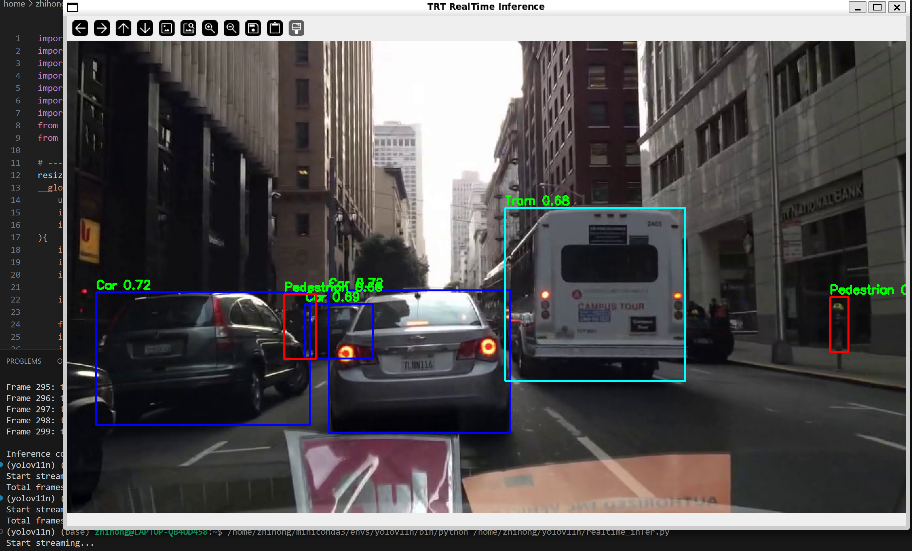

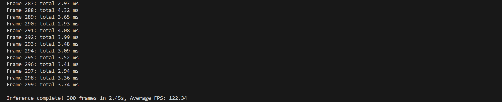

---